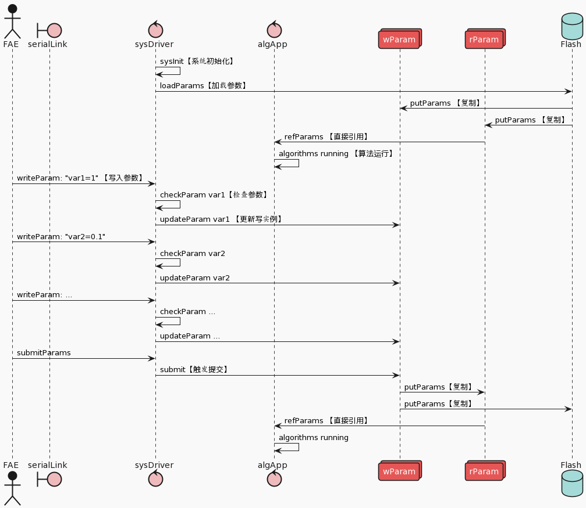
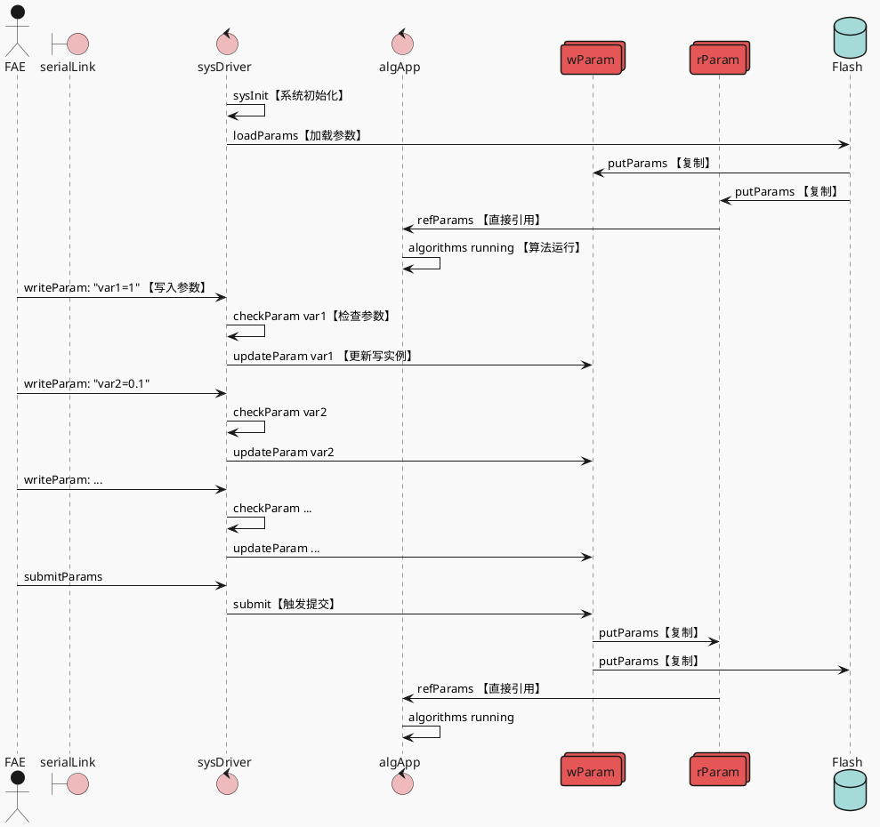

# 主控调参概要设计

## 设计原则：

PC-设备间应用协议基于文本命令，由设备端解析；可用自研工具或第三方串口、蓝牙调试工具做配置；肉眼可读可排错。

设备端参数在内存中有两个实例，读写分离；PC可通过“写”命令修改写实例中除版本号外的任意参数；PC通过“提交”命令将写实例中配置完毕的参数更新到读实例及非易失存储做持久化。

设备端系统初始化时，将非易事存储中的参数备份加载到内存的读、写实例中。

设备端应用仅使用读实例中的参数。



## 调参时序示意：



## 代码示意

### 参数结构示意

```c
struct aeb_cms_params
{
    u32 pid; //Product ID
    u32 vid; //Version ID 
    float hmw_thr;
    float ttc_thr;
    // and so on ...
};

struct aeb_cms_params wParams; // "write Copy"
struct aeb_cms_params rParms; // "read Copy"

```

### 调参命令示意

调参接口建议采用标准AT命令

```powershell
at+hmw_thr=1.4
at+ttc_thr=0.8
at+submit
```

### AT解析示意

参考：[marcinbor85/cAT: Plain C library for parsing AT commands for use in host devices. (github.com)](https://github.com/marcinbor85/cAT)

```c
typedef enum {
        CAT_VAR_INT_DEC = 0, /* decimal encoded signed integer variable */
        CAT_VAR_UINT_DEC, /* decimal encoded unsigned integer variable */
        CAT_VAR_NUM_HEX, /* hexadecimal encoded unsigned integer variable */
        CAT_VAR_BUF_HEX, /* asciihex encoded bytes array */
        CAT_VAR_BUF_STRING /* string variable */
} cat_var_type;

static struct cat_variable set_vars[] = {
        {
                .type = CAT_VAR_INT_DEC,
                .data = &speed,
                .data_size = sizeof(speed),
                .write = speed_write,
                .name = "speed"
        },
// And so on and so on
}

static int speed_write(const struct cat_variable *var, size_t write_size)
{
        printf("speed variable updated internally to: %d\n", speed);
        return 0;
}
```
